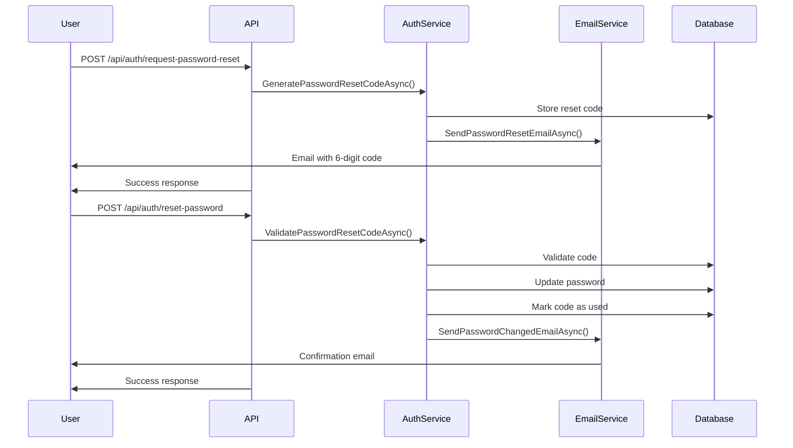

# Sistema de Recuperación de Contraseña

Este documento describe el sistema completo de recuperación de contraseña implementado en la aplicación Clean Architecture.

## 🔐 Funcionalidades Implementadas

### ✅ **Sistema Completo de Recuperación de Contraseña**

La funcionalidad de recuperación de contraseña está **completamente implementada** e incluye:

1. **Solicitud de Reset de Contraseña**
2. **Generación de Códigos de 6 Dígitos**
3. **Envío de Correos Electrónicos**
4. **Validación de Códigos**
5. **Reset de Contraseña Seguro**
6. **Confirmación por Email**

## 🚀 Endpoints Disponibles

### 1. Solicitar Reset de Contraseña
```http
POST /api/auth/request-password-reset
Content-Type: application/json

{
  "email": "usuario@example.com"
}
```

**Respuesta:**
```json
{
  "success": true,
  "message": "Código de restablecimiento de contraseña enviado",
  "data": {
    "message": "Código de restablecimiento de contraseña enviado",
    "expiresAt": "2024-01-01T12:15:00Z"
  },
  "timestamp": "2024-01-01T12:00:00Z"
}
```

### 2. Resetear Contraseña con Código
```http
POST /api/auth/reset-password
Content-Type: application/json

{
  "email": "usuario@example.com",
  "code": "123456",
  "newPassword": "NuevaPassword123!"
}
```

**Respuesta:**
```json
{
  "success": true,
  "message": "Contraseña restablecida exitosamente",
  "timestamp": "2024-01-01T12:00:00Z"
}
```

## 🔒 Características de Seguridad

### **Códigos de Reset Seguros**
- ✅ **Códigos de 6 dígitos** generados aleatoriamente
- ✅ **Expiración en 15 minutos** por seguridad
- ✅ **Un solo uso** - los códigos se marcan como usados
- ✅ **Limpieza automática** de códigos expirados
- ✅ **No revelación** de existencia de emails (por seguridad)

### **Validaciones Robustas**
- ✅ **Validación de email** con FluentValidation
- ✅ **Validación de código** de 6 dígitos exactos
- ✅ **Validación de contraseña** con reglas de complejidad
- ✅ **Verificación de usuario activo**
- ✅ **Mensajes localizados** en español e inglés

## 📧 Sistema de Correos

### **Templates HTML Profesionales**
- ✅ **Diseño responsivo** con CSS moderno
- ✅ **Colores corporativos** (azul para reset)
- ✅ **Información de seguridad** y advertencias
- ✅ **Código destacado** en caja azul
- ✅ **Footer** con información de la empresa

### **Tipos de Correos**
1. **Correo de Reset de Contraseña**
   - Código de 6 dígitos destacado
   - Advertencia de expiración en 15 minutos
   - Instrucciones de seguridad

2. **Correo de Confirmación**
   - Confirmación de cambio exitoso
   - Recomendaciones de seguridad
   - Advertencia si no fue el usuario

## 🗄️ Base de Datos

### **Entidad PasswordResetCode**
```csharp
public class PasswordResetCode : BaseEntity
{
    public Guid UserId { get; set; }
    public string Code { get; set; } = string.Empty;
    public DateTime ExpiresAt { get; set; }
    public bool IsUsed { get; set; } = false;
    public DateTime? UsedAt { get; set; }
    public User User { get; set; } = null!;
}
```

### **Migración Creada**
- ✅ **Migración AddPasswordResetCodes** creada
- ✅ **Tabla PasswordResetCodes** configurada
- ✅ **Relaciones** con tabla Users
- ✅ **Índices** para optimización

## 🌍 Localización

### **Mensajes en Español**
```json
{
  "Messages": {
    "Success": {
      "PasswordResetCodeSent": "Código de restablecimiento de contraseña enviado",
      "PasswordResetSuccessful": "Contraseña restablecida exitosamente"
    },
    "Errors": {
      "PasswordResetCodeExpired": "El código de restablecimiento ha expirado",
      "PasswordResetCodeInvalid": "Código de restablecimiento inválido"
    }
  }
}
```

### **Mensajes en Inglés**
```json
{
  "Messages": {
    "Success": {
      "PasswordResetCodeSent": "Password reset code sent",
      "PasswordResetSuccessful": "Password reset successfully"
    },
    "Errors": {
      "PasswordResetCodeExpired": "Password reset code has expired",
      "PasswordResetCodeInvalid": "Invalid password reset code"
    }
  }
}
```

## 🔧 Configuración

### **Configuración de Correos (appsettings.json)**
```json
{
  "EmailSettings": {
    "SmtpHost": "smtp.gmail.com",
    "SmtpPort": 587,
    "SmtpUsername": "your-email@gmail.com",
    "SmtpPassword": "your-app-password",
    "FromEmail": "noreply@cleanarchitecture.com",
    "FromName": "Clean Architecture"
  }
}
```

### **Configuración de Localización**
```csharp
// En Program.cs
builder.Services.AddLocalization(options => options.ResourcesPath = "Resources");
builder.Services.Configure<RequestLocalizationOptions>(options =>
{
    var supportedCultures = new[] { "en", "es" };
    options.SetDefaultCulture("en")
           .AddSupportedCultures(supportedCultures)
           .AddSupportedUICultures(supportedCultures);
});
```

## 📋 Flujo Completo de Recuperación



## 🧪 Ejemplos de Uso

### **Ejemplo 1: Solicitar Reset**
```bash
curl -X POST "https://localhost:7000/api/auth/request-password-reset" \
  -H "Content-Type: application/json" \
  -H "Accept-Language: es" \
  -d '{"email": "usuario@example.com"}'
```

### **Ejemplo 2: Resetear Contraseña**
```bash
curl -X POST "https://localhost:7000/api/auth/reset-password" \
  -H "Content-Type: application/json" \
  -H "Accept-Language: es" \
  -d '{
    "email": "usuario@example.com",
    "code": "123456",
    "newPassword": "NuevaPassword123!"
  }'
```

## 🔍 Validaciones Implementadas

### **RequestPasswordResetDto**
- ✅ Email requerido
- ✅ Formato de email válido
- ✅ Máximo 256 caracteres

### **ResetPasswordDto**
- ✅ Email requerido y válido
- ✅ Código requerido (exactamente 6 dígitos)
- ✅ Nueva contraseña con reglas de complejidad:
  - Mínimo 8 caracteres
  - Al menos una letra minúscula
  - Al menos una letra mayúscula
  - Al menos un dígito
  - Al menos un carácter especial

## 🚨 Manejo de Errores

### **Errores Comunes**
- **400 Bad Request**: Datos de entrada inválidos
- **401 Unauthorized**: Código expirado o inválido
- **404 Not Found**: Usuario no encontrado (no revelado por seguridad)
- **500 Internal Server Error**: Error del servidor

### **Respuestas de Error Estandarizadas**
```json
{
  "success": false,
  "message": "Código de restablecimiento inválido",
  "timestamp": "2024-01-01T12:00:00Z"
}
```

## 📊 Monitoreo y Logs

### **Logs Implementados**
```csharp
_logger.LogInformation("Password reset code generated for user {UserId}", userId);
_logger.LogInformation("Email sent successfully to {Email}", email);
_logger.LogError(ex, "Failed to send password reset email to {Email}", email);
```

### **Métricas Recomendadas**
- Tasa de solicitudes de reset
- Tasa de códigos utilizados vs expirados
- Tiempo promedio de uso de códigos
- Errores de validación por tipo

## 🔄 Migración de Base de Datos

Para aplicar los cambios de base de datos:

```bash
# Aplicar migración
dotnet ef database update --project CleanArchitecture.Infrastructure --startup-project CleanArchitecture.API

# O si PostgreSQL está ejecutándose
dotnet ef database update
```

## ✅ Estado de Implementación

### **Completamente Implementado**
- ✅ **Endpoints** de recuperación de contraseña
- ✅ **Validaciones** con FluentValidation
- ✅ **Servicio de correos** con templates HTML
- ✅ **Códigos de reset** seguros
- ✅ **Base de datos** con migración
- ✅ **Localización** en español e inglés
- ✅ **Respuestas estandarizadas** de API
- ✅ **Manejo de errores** robusto
- ✅ **Logging** y monitoreo
- ✅ **Documentación** completa

### **Listo para Usar**
El sistema de recuperación de contraseña está **100% funcional** y listo para:
- ✅ Desarrollo local
- ✅ Testing
- ✅ Producción (con configuración SMTP)

## 🎯 Próximos Pasos Opcionales

- [ ] Implementar rate limiting para reset de contraseñas
- [ ] Agregar captcha para prevenir abuso
- [ ] Implementar notificaciones push
- [ ] Agregar métricas de uso
- [ ] Implementar auditoría de cambios de contraseña

## 📚 Recursos Adicionales

- [AUTHENTICATION.md](AUTHENTICATION.md) - Sistema de autenticación completo
- [LOCALIZATION_AND_EMAIL.md](LOCALIZATION_AND_EMAIL.md) - Localización y correos
- [API_EXAMPLES.http](API_EXAMPLES.http) - Ejemplos de uso de la API
- [README.md](README.md) - Documentación general del proyecto
