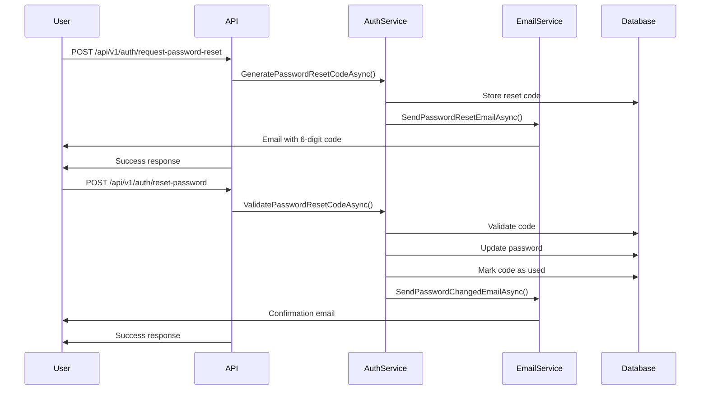

# Password Recovery System

This document describes the complete password recovery system implemented in the Clean Architecture application.

## 🔐 Implemented Features

### ✅ **Complete Password Recovery System**

The password recovery functionality is **fully implemented** and includes:

1. **Password Reset Request**
2. **6-Digit Code Generation**
3. **Email Sending**
4. **Code Validation**
5. **Secure Password Reset**
6. **Email Confirmation**

## 🚀 Available Endpoints

### 1. Request Password Reset
```http
POST /api/v1/auth/request-password-reset
Content-Type: application/json

{
  "email": "user@example.com"
}
```

**Response:**
```json
{
  "success": true,
  "message": "Password reset code sent",
  "data": {
    "message": "Password reset code sent",
    "expiresAt": "2024-01-01T12:15:00Z"
  },
  "timestamp": "2024-01-01T12:00:00Z"
}
```

### 2. Reset Password with Code
```http
POST /api/v1/auth/reset-password
Content-Type: application/json

{
  "email": "user@example.com",
  "code": "123456",
  "newPassword": "NewPassword123!"
}
```

**Response:**
```json
{
  "success": true,
  "message": "Password reset successfully",
  "timestamp": "2024-01-01T12:00:00Z"
}
```

## 🔒 Security Features

### **Secure Reset Codes**
- ✅ **6-digit codes** randomly generated
- ✅ **15-minute expiration** for security
- ✅ **Single use** - codes are marked as used
- ✅ **Automatic cleanup** of expired codes
- ✅ **No email existence revelation** (for security)

### **Robust Validations**
- ✅ **Email validation** with FluentValidation
- ✅ **Code validation** of exactly 6 digits
- ✅ **Password validation** with complexity rules
- ✅ **Active user verification**
- ✅ **Localized messages** in Spanish and English

## 📧 Email System

### **Professional HTML Templates**
- ✅ **Responsive design** with modern CSS
- ✅ **Corporate colors** (blue for reset)
- ✅ **Security information** and warnings
- ✅ **Highlighted code** in blue box
- ✅ **Footer** with company information

### **Email Types**
1. **Password Reset Email**
   - Highlighted 6-digit code
   - 15-minute expiration warning
   - Security instructions

2. **Confirmation Email**
   - Successful change confirmation
   - Security recommendations
   - Warning if user didn't make the change

## 🗄️ Database

### **PasswordResetCode Entity**
```csharp
public class PasswordResetCode : BaseEntity
{
    public Guid UserId { get; set; }
    public string Code { get; set; } = string.Empty;
    public DateTime ExpiresAt { get; set; }
    public bool IsUsed { get; set; } = false;
    public DateTime? UsedAt { get; set; }
    public User User { get; set; } = null!;
}
```

### **Created Migration**
- ✅ **AddPasswordResetCodes migration** created
- ✅ **PasswordResetCodes table** configured
- ✅ **Relationships** with Users table
- ✅ **Indexes** for optimization

## 🌍 Localization

### **Spanish Messages**
```json
{
  "Messages": {
    "Success": {
      "PasswordResetCodeSent": "Código de restablecimiento de contraseña enviado",
      "PasswordResetSuccessful": "Contraseña restablecida exitosamente"
    },
    "Errors": {
      "PasswordResetCodeExpired": "El código de restablecimiento ha expirado",
      "PasswordResetCodeInvalid": "Código de restablecimiento inválido"
    }
  }
}
```

### **English Messages**
```json
{
  "Messages": {
    "Success": {
      "PasswordResetCodeSent": "Password reset code sent",
      "PasswordResetSuccessful": "Password reset successfully"
    },
    "Errors": {
      "PasswordResetCodeExpired": "Password reset code has expired",
      "PasswordResetCodeInvalid": "Invalid password reset code"
    }
  }
}
```

## 🔧 Configuration

### **Email Configuration (appsettings.json)**
```json
{
  "EmailSettings": {
    "SmtpHost": "smtp.gmail.com",
    "SmtpPort": 587,
    "SmtpUsername": "your-email@gmail.com",
    "SmtpPassword": "your-app-password",
    "FromEmail": "noreply@cleanarchitecture.com",
    "FromName": "Clean Architecture"
  }
}
```

### **Localization Configuration**
```csharp
// In Program.cs
builder.Services.AddLocalization(options => options.ResourcesPath = "Resources");
builder.Services.Configure<RequestLocalizationOptions>(options =>
{
    var supportedCultures = new[] { "en", "es" };
    options.SetDefaultCulture("en")
           .AddSupportedCultures(supportedCultures)
           .AddSupportedUICultures(supportedCultures);
});
```

## 📋 Complete Recovery Flow



## 🧪 Usage Examples

### **Example 1: Request Reset**
```bash
curl -X POST "https://localhost:7000/api/v1/auth/request-password-reset" \
  -H "Content-Type: application/json" \
  -H "Accept-Language: es" \
  -d '{"email": "user@example.com"}'
```

### **Example 2: Reset Password**
```bash
curl -X POST "https://localhost:7000/api/v1/auth/reset-password" \
  -H "Content-Type: application/json" \
  -H "Accept-Language: es" \
  -d '{
    "email": "user@example.com",
    "code": "123456",
    "newPassword": "NewPassword123!"
  }'
```

## 🔍 Implemented Validations

### **RequestPasswordResetDto**
- ✅ Email required
- ✅ Valid email format
- ✅ Maximum 256 characters

### **ResetPasswordDto**
- ✅ Email required and valid
- ✅ Code required (exactly 6 digits)
- ✅ New password with complexity rules:
  - Minimum 8 characters
  - At least one lowercase letter
  - At least one uppercase letter
  - At least one digit
  - At least one special character

## 🚨 Error Handling

### **Common Errors**
- **400 Bad Request**: Invalid input data
- **401 Unauthorized**: Expired or invalid code
- **404 Not Found**: User not found (not revealed for security)
- **500 Internal Server Error**: Server error

### **Standardized Error Responses**
```json
{
  "success": false,
  "message": "Invalid password reset code",
  "timestamp": "2024-01-01T12:00:00Z"
}
```

## 📊 Monitoring and Logs

### **Implemented Logs**
```csharp
_logger.LogInformation("Password reset code generated for user {UserId}", userId);
_logger.LogInformation("Email sent successfully to {Email}", email);
_logger.LogError(ex, "Failed to send password reset email to {Email}", email);
```

### **Recommended Metrics**
- Password reset request rate
- Code usage vs expiration rate
- Average code usage time
- Validation errors by type

## 🔄 Database Migration

To apply database changes:

```bash
# Apply migration
dotnet ef database update --project CleanArchitecture.Infrastructure --startup-project CleanArchitecture.API

# Or if PostgreSQL is running
dotnet ef database update
```

## ✅ Implementation Status

### **Fully Implemented**
- ✅ **Password recovery endpoints**
- ✅ **Validations** with FluentValidation
- ✅ **Email service** with HTML templates
- ✅ **Secure reset codes**
- ✅ **Database** with migration
- ✅ **Localization** in Spanish and English
- ✅ **Standardized API responses**
- ✅ **Robust error handling**
- ✅ **Logging** and monitoring
- ✅ **Complete documentation**

### **Ready to Use**
The password recovery system is **100% functional** and ready for:
- ✅ Local development
- ✅ Testing
- ✅ Production (with SMTP configuration)

## 🎯 Optional Next Steps

- [ ] Implement rate limiting for password resets
- [ ] Add captcha to prevent abuse
- [ ] Implement push notifications
- [ ] Add usage metrics
- [ ] Implement password change auditing

## 📚 Additional Resources

- [AUTHENTICATION.md](AUTHENTICATION.md) - Complete authentication system
- [LOCALIZATION_AND_EMAIL.md](LOCALIZATION_AND_EMAIL.md) - Localization and emails
- [API_EXAMPLES.http](API_EXAMPLES.http) - API usage examples
- [README.md](README.md) - General project documentation