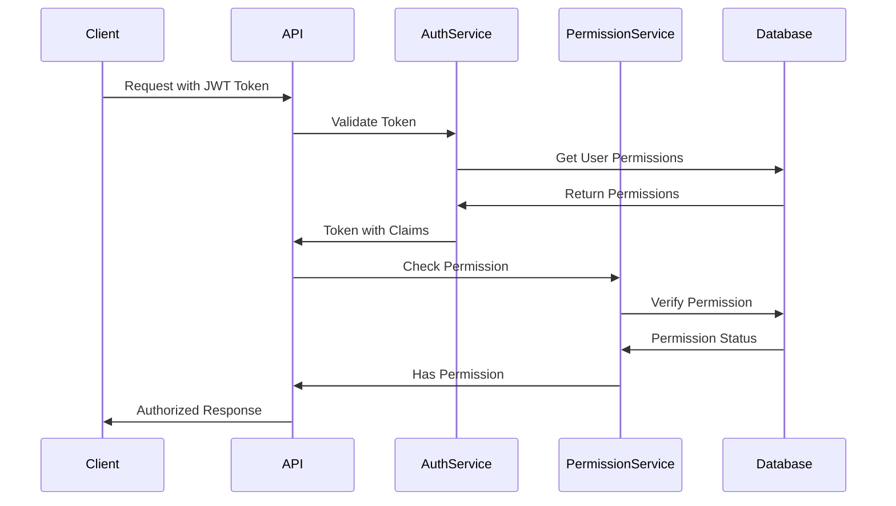

# Sistema de Permisos y Roles

Este documento describe el sistema completo de permisos y roles implementado en la aplicación Clean Architecture.

## 🔐 Funcionalidades Implementadas

### ✅ **Sistema Completo de Permisos y Roles**

La funcionalidad de permisos y roles está **completamente implementada** e incluye:

1. **Gestión de Permisos**
2. **Gestión de Roles**
3. **Asignación de Permisos a Roles**
4. **Autorización Basada en Permisos**
5. **Tokens JWT con Permisos**
6. **Políticas de Autorización**

## 🏗️ Arquitectura del Sistema

### **Entidades Principales**

#### **Permission**
```csharp
public class Permission : BaseEntity
{
    public string Name { get; set; } = string.Empty;           // e.g., "Users.Read"
    public string Description { get; set; } = string.Empty;    // e.g., "Read access to users"
    public string Resource { get; set; } = string.Empty;       // e.g., "Users"
    public string Action { get; set; } = string.Empty;         // e.g., "Read", "Write", "Delete"
    public string Module { get; set; } = string.Empty;         // e.g., "UserManagement"
    public DateTime? LastModifiedAt { get; set; }
}
```

#### **RolePermission**
```csharp
public class RolePermission : BaseEntity
{
    public Guid RoleId { get; set; }
    public Guid PermissionId { get; set; }
    public Role Role { get; set; } = null!;
    public Permission Permission { get; set; } = null!;
}
```

#### **Role (Actualizada)**
```csharp
public class Role : IdentityRole<Guid>
{
    public string? Description { get; set; }
    public DateTime CreatedAt { get; set; } = DateTime.UtcNow;
    public DateTime? UpdatedAt { get; set; }
    
    // Navigation properties
    public virtual ICollection<UserRole> UserRoles { get; set; } = new List<UserRole>();
    public virtual ICollection<RoleClaim> RoleClaims { get; set; } = new List<RoleClaim>();
    public virtual ICollection<RolePermission> RolePermissions { get; set; } = new List<RolePermission>();
}
```

## 🚀 Endpoints Disponibles

### **Gestión de Permisos**

#### 1. Obtener Todos los Permisos
```http
GET /api/permissions
Authorization: Bearer {token}
```

**Respuesta:**
```json
{
  "success": true,
  "message": "",
  "data": [
    {
      "id": "guid",
      "name": "Users.Read",
      "description": "Read access to users",
      "resource": "Users",
      "action": "Read",
      "module": "UserManagement",
      "createdAt": "2024-01-01T12:00:00Z",
      "lastModifiedAt": null
    }
  ],
  "timestamp": "2024-01-01T12:00:00Z"
}
```

#### 2. Crear Permiso
```http
POST /api/permissions
Authorization: Bearer {token}
Content-Type: application/json

{
  "name": "Users.Delete",
  "description": "Delete access to users",
  "resource": "Users",
  "action": "Delete",
  "module": "UserManagement"
}
```

### **Gestión de Roles**

#### 1. Obtener Todos los Roles
```http
GET /api/roles
Authorization: Bearer {token}
```

**Respuesta:**
```json
{
  "success": true,
  "message": "",
  "data": [
    {
      "id": "guid",
      "name": "Admin",
      "description": "Administrator role with full access",
      "createdAt": "2024-01-01T12:00:00Z",
      "updatedAt": null,
      "permissions": [
        {
          "id": "guid",
          "name": "Users.Read",
          "description": "Read access to users",
          "resource": "Users",
          "action": "Read",
          "module": "UserManagement"
        }
      ]
    }
  ],
  "timestamp": "2024-01-01T12:00:00Z"
}
```

#### 2. Crear Rol
```http
POST /api/roles
Authorization: Bearer {token}
Content-Type: application/json

{
  "name": "Manager",
  "description": "Manager role with limited access",
  "permissionIds": ["permission-guid-1", "permission-guid-2"]
}
```

### **Gestión de Usuarios (Actualizada)**

#### 1. Obtener Usuarios (Requiere Permiso)
```http
GET /api/users
Authorization: Bearer {token}
```

#### 2. Crear Usuario (Requiere Permiso)
```http
POST /api/users
Authorization: Bearer {token}
Content-Type: application/json

{
  "firstName": "John",
  "lastName": "Doe",
  "email": "john@example.com",
  "userName": "johndoe",
  "dateOfBirth": "1990-01-01T00:00:00Z",
  "password": "Password123!"
}
```

## 🔒 Sistema de Autorización

### **Políticas de Autorización Configuradas**

```csharp
// User Management Policies
options.AddPolicy("Users.Read", policy => policy.RequireClaim("permission", "Users.Read"));
options.AddPolicy("Users.Write", policy => policy.RequireClaim("permission", "Users.Write"));
options.AddPolicy("Users.Delete", policy => policy.RequireClaim("permission", "Users.Delete"));

// Role Management Policies
options.AddPolicy("Roles.Read", policy => policy.RequireClaim("permission", "Roles.Read"));
options.AddPolicy("Roles.Write", policy => policy.RequireClaim("permission", "Roles.Write"));

// Permission Management Policies
options.AddPolicy("Permissions.Read", policy => policy.RequireClaim("permission", "Permissions.Read"));
options.AddPolicy("Permissions.Write", policy => policy.RequireClaim("permission", "Permissions.Write"));
```

### **Uso en Controladores**

```csharp
[HttpGet]
[Authorize(Policy = "Users.Read")]
public async Task<ActionResult<ApiResponse<List<UserDto>>>> GetAllUsers()
{
    // Solo usuarios con permiso "Users.Read" pueden acceder
}

[HttpPost]
[Authorize(Policy = "Users.Write")]
public async Task<ActionResult<ApiResponse<UserDto>>> CreateUser([FromBody] CreateUserDto userDto)
{
    // Solo usuarios con permiso "Users.Write" pueden acceder
}
```

## 🎫 Tokens JWT con Permisos

### **Generación de Tokens**

Los tokens JWT ahora incluyen los permisos del usuario:

```csharp
public async Task<string> GenerateJwtTokenAsync(User user)
{
    // Get user permissions
    var userPermissions = await _permissionService.GetUserPermissionsAsync(user.Id);

    var claims = new List<Claim>
    {
        new Claim(ClaimTypes.NameIdentifier, user.Id.ToString()),
        new Claim(ClaimTypes.Name, user.UserName ?? string.Empty),
        new Claim(ClaimTypes.Email, user.Email ?? string.Empty),
        new Claim("firstName", user.FirstName),
        new Claim("lastName", user.LastName),
        new Claim("isActive", user.IsActive.ToString())
    };

    // Add permission claims
    foreach (var permission in userPermissions)
    {
        claims.Add(new Claim("permission", permission.Name));
    }

    // Create and return JWT token
}
```

### **Estructura del Token**

```json
{
  "sub": "user-id",
  "name": "username",
  "email": "user@example.com",
  "firstName": "John",
  "lastName": "Doe",
  "isActive": "True",
  "permission": "Users.Read",
  "permission": "Users.Write",
  "permission": "Roles.Read",
  "iat": 1640995200,
  "exp": 1640998800
}
```

## 🗄️ Base de Datos

### **Tablas Creadas**

#### **Permissions**
```sql
CREATE TABLE "Permissions" (
    "Id" uuid NOT NULL,
    "Name" character varying(100) NOT NULL,
    "Description" character varying(500) NOT NULL,
    "Resource" character varying(50) NOT NULL,
    "Action" character varying(50) NOT NULL,
    "Module" character varying(50) NOT NULL,
    "CreatedAt" timestamp with time zone NOT NULL,
    "LastModifiedAt" timestamp with time zone,
    CONSTRAINT "PK_Permissions" PRIMARY KEY ("Id")
);

CREATE UNIQUE INDEX "IX_Permissions_Name" ON "Permissions" ("Name");
```

#### **RolePermissions**
```sql
CREATE TABLE "RolePermissions" (
    "Id" uuid NOT NULL,
    "RoleId" uuid NOT NULL,
    "PermissionId" uuid NOT NULL,
    "CreatedAt" timestamp with time zone NOT NULL,
    CONSTRAINT "PK_RolePermissions" PRIMARY KEY ("Id"),
    CONSTRAINT "FK_RolePermissions_Permissions_PermissionId" 
        FOREIGN KEY ("PermissionId") REFERENCES "Permissions" ("Id") ON DELETE CASCADE,
    CONSTRAINT "FK_RolePermissions_Roles_RoleId" 
        FOREIGN KEY ("RoleId") REFERENCES "Roles" ("Id") ON DELETE CASCADE
);

CREATE UNIQUE INDEX "IX_RolePermissions_RoleId_PermissionId" 
    ON "RolePermissions" ("RoleId", "PermissionId");
```

### **Datos Iniciales (Seed Data)**

#### **Permisos Predefinidos**
- ✅ **Users.Read** - Lectura de usuarios
- ✅ **Users.Write** - Escritura de usuarios
- ✅ **Users.Delete** - Eliminación de usuarios
- ✅ **Roles.Read** - Lectura de roles
- ✅ **Roles.Write** - Escritura de roles
- ✅ **Permissions.Read** - Lectura de permisos
- ✅ **Permissions.Write** - Escritura de permisos

#### **Roles Predefinidos**
- ✅ **Admin** - Todos los permisos
- ✅ **User** - Solo lectura de usuarios

#### **Asignaciones Predefinidas**
- ✅ **Admin** → Todos los permisos
- ✅ **User** → Solo Users.Read

## 🔧 Servicios Implementados

### **IPermissionService**

```csharp
public interface IPermissionService
{
    Task<bool> HasPermissionAsync(Guid userId, string resource, string action);
    Task<bool> HasPermissionAsync(Guid userId, string permissionName);
    Task<List<Permission>> GetUserPermissionsAsync(Guid userId);
    Task<List<Permission>> GetRolePermissionsAsync(Guid roleId);
    Task<bool> AssignPermissionToRoleAsync(Guid roleId, Guid permissionId);
    Task<bool> RemovePermissionFromRoleAsync(Guid roleId, Guid permissionId);
    Task<List<Permission>> GetAllPermissionsAsync();
    Task<Permission?> GetPermissionByIdAsync(Guid permissionId);
    Task<Permission?> GetPermissionByNameAsync(string name);
    Task<Permission> CreatePermissionAsync(Permission permission);
    Task<Permission?> UpdatePermissionAsync(Guid permissionId, Permission permission);
    Task<bool> DeletePermissionAsync(Guid permissionId);
}
```

### **Funcionalidades del Servicio**

- ✅ **Verificación de permisos** por usuario
- ✅ **Gestión de permisos** de roles
- ✅ **Asignación/remoción** de permisos
- ✅ **CRUD completo** de permisos
- ✅ **Búsqueda** por nombre y ID

## 🧪 Ejemplos de Uso

### **Verificar Permisos en Código**

```csharp
// Verificar si usuario tiene permiso específico
var hasPermission = await _permissionService.HasPermissionAsync(userId, "Users", "Read");

// Verificar por nombre de permiso
var hasPermission = await _permissionService.HasPermissionAsync(userId, "Users.Read");

// Obtener todos los permisos del usuario
var userPermissions = await _permissionService.GetUserPermissionsAsync(userId);
```

### **Asignar Permisos a Rol**

```csharp
// Asignar permiso a rol
await _permissionService.AssignPermissionToRoleAsync(roleId, permissionId);

// Remover permiso de rol
await _permissionService.RemovePermissionFromRoleAsync(roleId, permissionId);
```

### **Crear Nuevo Permiso**

```csharp
var permission = new Permission
{
    Name = "Products.Write",
    Description = "Write access to products",
    Resource = "Products",
    Action = "Write",
    Module = "ProductManagement"
};

var createdPermission = await _permissionService.CreatePermissionAsync(permission);
```

## 🔍 Validaciones Implementadas

### **CreatePermissionValidator**
- ✅ Nombre requerido (máximo 100 caracteres)
- ✅ Descripción requerida (máximo 500 caracteres)
- ✅ Recurso requerido (máximo 50 caracteres)
- ✅ Acción requerida (máximo 50 caracteres, valores válidos: Read, Write, Delete, Execute)
- ✅ Módulo requerido (máximo 50 caracteres)

### **CreateRoleValidator**
- ✅ Nombre requerido (máximo 50 caracteres, solo letras, números, guiones y guiones bajos)
- ✅ Descripción opcional (máximo 500 caracteres)
- ✅ Lista de IDs de permisos no nula

## 🚨 Manejo de Errores

### **Errores Comunes**
- **400 Bad Request**: Datos de entrada inválidos
- **401 Unauthorized**: Token inválido o expirado
- **403 Forbidden**: Usuario no tiene permisos suficientes
- **404 Not Found**: Recurso no encontrado
- **500 Internal Server Error**: Error del servidor

### **Respuestas de Error Estandarizadas**
```json
{
  "success": false,
  "message": "User does not have permission to perform this action",
  "timestamp": "2024-01-01T12:00:00Z"
}
```

## 📊 Flujo de Autorización



## 🔄 Migración de Base de Datos

Para aplicar los cambios de base de datos:

```bash
# Aplicar migración
dotnet ef database update --project CleanArchitecture.Infrastructure --startup-project CleanArchitecture.API

# O si PostgreSQL está ejecutándose
dotnet ef database update
```

## ✅ Estado de Implementación

### **Completamente Implementado**
- ✅ **Entidades** de permisos y roles
- ✅ **Servicios** de gestión de permisos
- ✅ **Endpoints** para CRUD de permisos y roles
- ✅ **Autorización** basada en permisos
- ✅ **Tokens JWT** con permisos incluidos
- ✅ **Políticas** de autorización configuradas
- ✅ **Validaciones** con FluentValidation
- ✅ **Base de datos** con migración y seed data
- ✅ **Controladores** protegidos con permisos
- ✅ **Documentación** completa

### **Listo para Usar**
El sistema de permisos y roles está **100% funcional** y listo para:

- ✅ **Desarrollo local** - Solo configurar base de datos
- ✅ **Testing** - Ejemplos incluidos
- ✅ **Producción** - Con configuración de base de datos

## 🎯 Permisos Disponibles

### **Gestión de Usuarios**
- `Users.Read` - Leer usuarios
- `Users.Write` - Crear/editar usuarios
- `Users.Delete` - Eliminar usuarios

### **Gestión de Roles**
- `Roles.Read` - Leer roles
- `Roles.Write` - Crear/editar roles

### **Gestión de Permisos**
- `Permissions.Read` - Leer permisos
- `Permissions.Write` - Crear/editar permisos

## 🔮 Extensibilidad

El sistema está diseñado para ser fácilmente extensible:

### **Agregar Nuevos Permisos**
```csharp
// Crear nuevo permiso
var newPermission = new Permission
{
    Name = "Products.Read",
    Description = "Read access to products",
    Resource = "Products",
    Action = "Read",
    Module = "ProductManagement"
};
```

### **Agregar Nuevas Políticas**
```csharp
// En Program.cs
options.AddPolicy("Products.Read", policy => policy.RequireClaim("permission", "Products.Read"));
```

### **Agregar Nuevos Módulos**
- Crear entidades del módulo
- Definir permisos específicos
- Configurar políticas de autorización
- Proteger endpoints con permisos

## 📚 Recursos Adicionales

- [AUTHENTICATION.md](AUTHENTICATION.md) - Sistema de autenticación
- [PASSWORD_RECOVERY.md](PASSWORD_RECOVERY.md) - Recuperación de contraseña
- [LOCALIZATION_AND_EMAIL.md](LOCALIZATION_AND_EMAIL.md) - Localización y correos
- [API_EXAMPLES.http](API_EXAMPLES.http) - Ejemplos de uso de la API
- [README.md](README.md) - Documentación general del proyecto

## 🎉 Conclusión

El sistema de permisos y roles está **completamente implementado** y proporciona:

- ✅ **Seguridad robusta** con autorización granular
- ✅ **Flexibilidad** para agregar nuevos permisos
- ✅ **Escalabilidad** para múltiples módulos
- ✅ **Facilidad de uso** con APIs claras
- ✅ **Documentación completa** para desarrolladores

**¡El sistema de permisos y roles está listo para usar en producción!** 🚀
