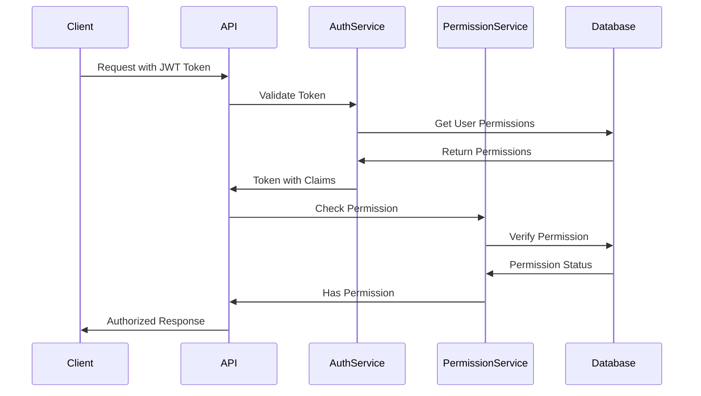

# Permissions and Roles System

This document describes the complete permissions and roles system implemented in the Clean Architecture application.

## 🔐 Implemented Features

### ✅ **Complete Permissions and Roles System**

The permissions and roles functionality is **fully implemented** and includes:

1. **Permission Management**
2. **Role Management**
3. **Permission Assignment to Roles**
4. **Permission-based Authorization**
5. **JWT Tokens with Permissions**
6. **Authorization Policies**

## 🏗️ System Architecture

### **Main Entities**

#### **Permission**

```csharp
public class Permission : BaseEntity
{
    public string Name { get; set; } = string.Empty;           // e.g., "Users.Read"
    public string Description { get; set; } = string.Empty;    // e.g., "Read access to users"
    public string Resource { get; set; } = string.Empty;       // e.g., "Users"
    public string Action { get; set; } = string.Empty;         // e.g., "Read", "Write", "Delete"
    public string Module { get; set; } = string.Empty;         // e.g., "UserManagement"
    public DateTime? LastModifiedAt { get; set; }
}
```

#### **RolePermission**

```csharp
public class RolePermission : BaseEntity
{
    public Guid RoleId { get; set; }
    public Guid PermissionId { get; set; }
    public Role Role { get; set; } = null!;
    public Permission Permission { get; set; } = null!;
}
```

#### **Role (Updated)**

```csharp
public class Role : IdentityRole<Guid>
{
    public string? Description { get; set; }
    public DateTime CreatedAt { get; set; } = DateTime.UtcNow;
    public DateTime? UpdatedAt { get; set; }

    // Navigation properties
    public virtual ICollection<UserRole> UserRoles { get; set; } = new List<UserRole>();
    public virtual ICollection<RoleClaim> RoleClaims { get; set; } = new List<RoleClaim>();
    public virtual ICollection<RolePermission> RolePermissions { get; set; } = new List<RolePermission>();
}
```

## 🚀 Available Endpoints

### **Permission Management**

#### 1. Get All Permissions

```http
GET /api/v1/permissions
Authorization: Bearer {token}
```

**Response:**

```json
{
  "success": true,
  "message": "",
  "data": [
    {
      "id": "guid",
      "name": "Users.Read",
      "description": "Read access to users",
      "resource": "Users",
      "action": "Read",
      "module": "UserManagement",
      "createdAt": "2024-01-01T12:00:00Z",
      "lastModifiedAt": null
    }
  ],
  "timestamp": "2024-01-01T12:00:00Z"
}
```

#### 2. Create Permission

```http
POST /api/v1/permissions
Authorization: Bearer {token}
Content-Type: application/json

{
  "name": "Users.Delete",
  "description": "Delete access to users",
  "resource": "Users",
  "action": "Delete",
  "module": "UserManagement"
}
```

### **Role Management**

#### 1. Get All Roles

```http
GET /api/v1/roles
Authorization: Bearer {token}
```

**Response:**

```json
{
  "success": true,
  "message": "",
  "data": [
    {
      "id": "guid",
      "name": "Admin",
      "description": "Administrator role with full access",
      "createdAt": "2024-01-01T12:00:00Z",
      "updatedAt": null,
      "permissions": [
        {
          "id": "guid",
          "name": "Users.Read",
          "description": "Read access to users",
          "resource": "Users",
          "action": "Read",
          "module": "UserManagement"
        }
      ]
    }
  ],
  "timestamp": "2024-01-01T12:00:00Z"
}
```

#### 2. Create Role

```http
POST /api/v1/roles
Authorization: Bearer {token}
Content-Type: application/json

{
  "name": "Manager",
  "description": "Manager role with limited access",
  "permissionIds": ["permission-guid-1", "permission-guid-2"]
}
```

#### 3. Update Role Permissions

```http
PATCH /api/v1/roles/{id}/permissions
Authorization: Bearer {token}
Content-Type: application/json

{
  "permissionIds": ["permission-guid-1", "permission-guid-2", "permission-guid-3"]
}
```

### **User Management (Updated)**

#### 1. Get Users (Requires Permission)

```http
GET /api/v1/users
Authorization: Bearer {token}
```

#### 2. Create User (Requires Permission)

```http
POST /api/v1/users
Authorization: Bearer {token}
Content-Type: application/json

{
  "firstName": "John",
  "lastName": "Doe",
  "email": "john@example.com",
  "userName": "johndoe",
  "dateOfBirth": "1990-01-01T00:00:00Z",
  "password": "Password123!"
}
```

#### 3. Get Paginated Users (Requires Permission)

```http
GET /api/v1/users/paginated?page=1&limit=10
Authorization: Bearer {token}
```

## 🔒 Authorization System

### **Configured Authorization Policies**

```csharp
// User Management Policies
options.AddPolicy("Users.Read", policy => policy.RequireClaim("permission", "Users.Read"));
options.AddPolicy("Users.Write", policy => policy.RequireClaim("permission", "Users.Write"));
options.AddPolicy("Users.Delete", policy => policy.RequireClaim("permission", "Users.Delete"));

// Role Management Policies
options.AddPolicy("Roles.Read", policy => policy.RequireClaim("permission", "Roles.Read"));
options.AddPolicy("Roles.Write", policy => policy.RequireClaim("permission", "Roles.Write"));

// Permission Management Policies
options.AddPolicy("Permissions.Read", policy => policy.RequireClaim("permission", "Permissions.Read"));
options.AddPolicy("Permissions.Write", policy => policy.RequireClaim("permission", "Permissions.Write"));
```

### **Usage in Controllers**

```csharp
[HttpGet]
[Authorize(Policy = "Users.Read")]
public async Task<ActionResult<ApiResponse<List<UserDto>>>> GetAllUsers()
{
    // Only users with "Users.Read" permission can access
}

[HttpPost]
[Authorize(Policy = "Users.Write")]
public async Task<ActionResult<ApiResponse<UserDto>>> CreateUser([FromBody] CreateUserDto userDto)
{
    // Only users with "Users.Write" permission can access
}
```

## 🎫 JWT Tokens with Permissions

### **Token Generation**

JWT tokens now include user permissions:

```csharp
public async Task<string> GenerateJwtTokenAsync(User user)
{
    // Get user permissions
    var userPermissions = await _permissionService.GetUserPermissionsAsync(user.Id);

    var claims = new List<Claim>
    {
        new Claim(ClaimTypes.NameIdentifier, user.Id.ToString()),
        new Claim(ClaimTypes.Name, user.UserName ?? string.Empty),
        new Claim(ClaimTypes.Email, user.Email ?? string.Empty),
        new Claim("firstName", user.FirstName),
        new Claim("lastName", user.LastName),
        new Claim("isActive", user.IsActive.ToString())
    };

    // Add permission claims
    foreach (var permission in userPermissions)
    {
        claims.Add(new Claim("permission", permission.Name));
    }

    // Create and return JWT token
}
```

### **Token Structure**

```json
{
  "sub": "user-id",
  "name": "username",
  "email": "user@example.com",
  "firstName": "John",
  "lastName": "Doe",
  "isActive": "True",
  "permission": "Users.Read",
  "permission": "Users.Write",
  "permission": "Roles.Read",
  "iat": 1640995200,
  "exp": 1640998800
}
```

## 🗄️ Database

### **Created Tables**

#### **Permissions**

```sql
CREATE TABLE "Permissions" (
    "Id" uuid NOT NULL,
    "Name" character varying(100) NOT NULL,
    "Description" character varying(500) NOT NULL,
    "Resource" character varying(50) NOT NULL,
    "Action" character varying(50) NOT NULL,
    "Module" character varying(50) NOT NULL,
    "CreatedAt" timestamp with time zone NOT NULL,
    "LastModifiedAt" timestamp with time zone,
    CONSTRAINT "PK_Permissions" PRIMARY KEY ("Id")
);

CREATE UNIQUE INDEX "IX_Permissions_Name" ON "Permissions" ("Name");
```

#### **RolePermissions**

```sql
CREATE TABLE "RolePermissions" (
    "Id" uuid NOT NULL,
    "RoleId" uuid NOT NULL,
    "PermissionId" uuid NOT NULL,
    "CreatedAt" timestamp with time zone NOT NULL,
    CONSTRAINT "PK_RolePermissions" PRIMARY KEY ("Id"),
    CONSTRAINT "FK_RolePermissions_Permissions_PermissionId"
        FOREIGN KEY ("PermissionId") REFERENCES "Permissions" ("Id") ON DELETE CASCADE,
    CONSTRAINT "FK_RolePermissions_Roles_RoleId"
        FOREIGN KEY ("RoleId") REFERENCES "Roles" ("Id") ON DELETE CASCADE
);

CREATE UNIQUE INDEX "IX_RolePermissions_RoleId_PermissionId"
    ON "RolePermissions" ("RoleId", "PermissionId");
```

### **Initial Data (Seed Data)**

#### **Predefined Permissions**

- ✅ **Users.Read** - User reading
- ✅ **Users.Write** - User writing
- ✅ **Users.Delete** - User deletion
- ✅ **Roles.Read** - Role reading
- ✅ **Roles.Write** - Role writing
- ✅ **Permissions.Read** - Permission reading
- ✅ **Permissions.Write** - Permission writing
- ✅ **System.Admin** - System administration

#### **Predefined Roles**

- ✅ **Admin** - All permissions
- ✅ **User** - Only user reading

#### **Predefined Assignments**

- ✅ **Admin** → All permissions
- ✅ **User** → Only Users.Read

## 🔧 Implemented Services

### **IPermissionService**

```csharp
public interface IPermissionService
{
    Task<bool> HasPermissionAsync(Guid userId, string resource, string action);
    Task<bool> HasPermissionAsync(Guid userId, string permissionName);
    Task<List<Permission>> GetUserPermissionsAsync(Guid userId);
    Task<List<Permission>> GetRolePermissionsAsync(Guid roleId);
    Task<bool> AssignPermissionToRoleAsync(Guid roleId, Guid permissionId);
    Task<bool> RemovePermissionFromRoleAsync(Guid roleId, Guid permissionId);
    Task<List<Permission>> GetAllPermissionsAsync();
    Task<Permission?> GetPermissionByIdAsync(Guid permissionId);
    Task<Permission?> GetPermissionByNameAsync(string name);
    Task<Permission> CreatePermissionAsync(Permission permission);
    Task<Permission?> UpdatePermissionAsync(Guid permissionId, Permission permission);
    Task<bool> DeletePermissionAsync(Guid permissionId);
}
```

### **Service Features**

- ✅ **Permission verification** by user
- ✅ **Permission management** for roles
- ✅ **Permission assignment/removal**
- ✅ **Full CRUD** for permissions
- ✅ **Search** by name and ID

## 🧪 Usage Examples

### **Check Permissions in Code**

```csharp
// Check if user has specific permission
var hasPermission = await _permissionService.HasPermissionAsync(userId, "Users", "Read");

// Check by permission name
var hasPermission = await _permissionService.HasPermissionAsync(userId, "Users.Read");

// Get all user permissions
var userPermissions = await _permissionService.GetUserPermissionsAsync(userId);
```

### **Assign Permissions to Role**

```csharp
// Assign permission to role
await _permissionService.AssignPermissionToRoleAsync(roleId, permissionId);

// Remove permission from role
await _permissionService.RemovePermissionFromRoleAsync(roleId, permissionId);
```

### **Create New Permission**

```csharp
var permission = new Permission
{
    Name = "Products.Write",
    Description = "Write access to products",
    Resource = "Products",
    Action = "Write",
    Module = "ProductManagement"
};

var createdPermission = await _permissionService.CreatePermissionAsync(permission);
```

## 🔍 Implemented Validations

### **CreatePermissionValidator**

- ✅ Name required (maximum 100 characters)
- ✅ Description required (maximum 500 characters)
- ✅ Resource required (maximum 50 characters)
- ✅ Action required (maximum 50 characters, valid values: Read, Write, Delete, Execute)
- ✅ Module required (maximum 50 characters)

### **CreateRoleValidator**

- ✅ Name required (maximum 50 characters, only letters, numbers, hyphens and underscores)
- ✅ Description optional (maximum 500 characters)
- ✅ Permission ID list not null

## 🚨 Error Handling

### **Common Errors**

- **400 Bad Request**: Invalid input data
- **401 Unauthorized**: Invalid or expired token
- **403 Forbidden**: User has insufficient permissions
- **404 Not Found**: Resource not found
- **500 Internal Server Error**: Server error

### **Standardized Error Responses**

```json
{
  "success": false,
  "message": "User does not have permission to perform this action",
  "timestamp": "2024-01-01T12:00:00Z"
}
```

## 📊 Authorization Flow



## 🔄 Database Migration

To apply database changes:

```bash
# Apply migration
dotnet ef database update --project CleanArchitecture.Infrastructure --startup-project CleanArchitecture.API

# Or if PostgreSQL is running
dotnet ef database update
```

## ✅ Implementation Status

### **Fully Implemented**

- ✅ **Entities** for permissions and roles
- ✅ **Services** for permission management
- ✅ **Endpoints** for CRUD of permissions and roles
- ✅ **Permission-based authorization**
- ✅ **JWT tokens** with included permissions
- ✅ **Authorization policies** configured
- ✅ **Validations** with FluentValidation
- ✅ **Database** with migration and seed data
- ✅ **Controllers** protected with permissions
- ✅ **Permission constants** for type safety
- ✅ **Complete documentation**

### **Ready to Use**

The permissions and roles system is **100% functional** and ready for:

- ✅ **Local development** - Just configure database
- ✅ **Testing** - Examples included
- ✅ **Production** - With database configuration

## 🎯 Available Permissions

### **New Simplified System (Recommended)**

#### **Core Management Permissions**

- `manage.roles` - Manage roles (create, update, delete, read)
- `manage.users` - Manage users (create, update, delete, read)
- `manage.user.roles` - Manage user-role assignments
- `manage.role.permissions` - Manage role-permission assignments

#### **Administrative Permissions**

- `admin` - Administrative access
- `superAdmin` - Super administrative access (includes all permissions)

### **Legacy System (Deprecated)**

#### **User Management**

- `Users.Read` - Read users
- `Users.Write` - Create/edit users
- `Users.Delete` - Delete users

#### **Role Management**

- `Roles.Read` - Read roles
- `Roles.Write` - Create/edit roles

#### **Permission Management**

- `Permissions.Read` - Read permissions
- `Permissions.Write` - Create/edit permissions

#### **System Administration**

- `System.Admin` - System administration

## 🔮 Extensibility

The system is designed to be easily extensible:

### **Add New Permissions**

```csharp
// Create new permission
var newPermission = new Permission
{
    Name = "Products.Read",
    Description = "Read access to products",
    Resource = "Products",
    Action = "Read",
    Module = "ProductManagement"
};
```

### **Add New Policies**

```csharp
// In Program.cs
options.AddPolicy("Products.Read", policy => policy.RequireClaim("permission", "Products.Read"));
```

### **Add New Modules**

- Create module entities
- Define specific permissions
- Configure authorization policies
- Protect endpoints with permissions

## 📚 Additional Resources

- [AUTHENTICATION.md](AUTHENTICATION.md) - Authentication system
- [PASSWORD_RECOVERY.md](PASSWORD_RECOVERY.md) - Password recovery
- [LOCALIZATION_AND_EMAIL.md](LOCALIZATION_AND_EMAIL.md) - Localization and emails
- [API_EXAMPLES.http](API_EXAMPLES.http) - API usage examples
- [README.md](README.md) - General project documentation

## 🎉 Conclusion

The permissions and roles system is **fully implemented** and provides:

- ✅ **Robust security** with granular authorization
- ✅ **Flexibility** to add new permissions
- ✅ **Scalability** for multiple modules
- ✅ **Ease of use** with clear APIs
- ✅ **Type safety** with permission constants
- ✅ **Complete documentation** for developers

**The permissions and roles system is ready for production use!** 🚀
